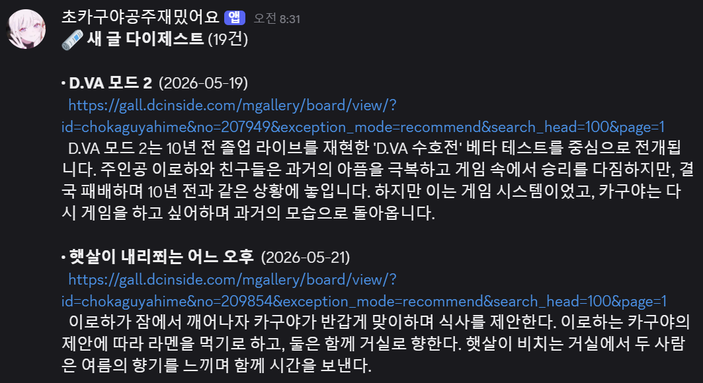

<div align="center">

# notice-watcher

게임 공지·게시판 새 글을 자동으로 디스코드로 알려주는 봇

URL을 넣으면 새 글을 요약해서 알림을 보냅니다.


[](https://n100-noticewatcher.tail4a65b8.ts.net)

📡 **[실시간 현황 보기](https://n100-noticewatcher.tail4a65b8.ts.net)** · 🤖 **[디스코드 봇 추가하기](https://discord.com/oauth2/authorize?client_id=1503367965880356984&permissions=2048&integration_type=0&scope=bot)**



</div>

---

## 봇 사용법

[봇을 서버에 추가](https://discord.com/oauth2/authorize?client_id=1503367965880356984&permissions=2048&integration_type=0&scope=bot)한 뒤 디스코드에서 슬래시 명령으로 사용합니다.

```
/watch <url> [filter:] [here:] [notify_empty:] [article_url:]
        ─ 게시판 URL 을 등록. 기본은 DM 으로 받음
        ─ filter: "점검 공지는 빼고 신규 콘텐츠만" 같이 자연어로 필터
        ─ here: 켜면 이 채널에 발송 (끄면 DM)
        ─ notify_empty: 켜면(기본) 새 글 없어도 "새 공지 없음" 한 줄 발송. 끄면 새 글 있을 때만

/list   ─ 내 구독 목록, 필터 수정, 구독 해제 UI
/setting ─ DM/채널 공지 ON/OFF + 매일 발송 시각(HH:MM KST) 설정
/report <issue> [slug:] [url:]
        ─ 사이트 문제 신고 또는 자유 의견
/help   ─ 명령어 안내
```

발송은 사용자별 시각(`HH:MM` KST, 기본 08:30) 에 하루 1회 digest. 폴링 주기와 독립 (ADR 0006).


## Features

- 일반 사이트: probe → LLM → 선언적 config(JSON) 생성, 3-layer 검증·재시도
- 알려진 플랫폼: URL 패턴만으로 probe·LLM skip 후 즉시 등록 — arca, dcinside, 네이버 카페·블로그, 다음 카페, reddit, tistory, lemmy, discourse, peertube 등
- 자동 실패 사이트는 hand-config 루프로 진입 → 단일 사이트 config 또는 probe/prompt/schema 자체를 개선
- `/watch <URL>` 디스코드 슬래시 명령 (`/list`, `/setting`, `/report`, `/help` + owner `/admin`)
- 새 글 요약 후 사용자별 발송 (`HH:MM` KST) digest 1회/일
- probe 정찰 툴 단독 사용 가능 (HAR · DOM · JSON API 후보 · 클릭 시뮬레이션)
- 게이트 — Safe Browsing v4, robots `Crawl-Delay`, SSRF/private-IP 차단, 정책 블랙리스트
- Gemini · GPT (Codex CLI) · OpenRouter — call_site 별 routing, dashboard 에서 hot swap
- dev 대시보드 (FastAPI + HTMX) — 잡 큐, 토큰 비용, per-phase trace, case audit, 플랫폼 config 승급 클러스터, 어휘 확장 deferred queue


## Quickstart (self-host)

```bash
# 1) 클론·의존성
git clone https://github.com/poisonous60/notice-watcher.git
cd notice-watcher
python -m venv .venv && source .venv/bin/activate    # Windows: .venv\Scripts\activate
pip install -r requirements.txt
playwright install chromium

# 2) .env 작성
cp deploy/.env.example .env
# 편집해서 채울 것:
#   BOT_TOKEN              = Discord Developer Portal → Application → Bot → Reset Token
#   GEMINI_API_KEYS        = key1,key2  (여러 개면 429 로테이트)
#   SAFE_BROWSING_API_KEY  = Google Cloud Console → Safe Browsing API 키 (없으면 신규 등록 차단)
#   OWNER_USER_ID          = 에러 트레이스백 DM 받을 Discord user ID
#   GUILD_ID               = (선택) 슬래시 명령 즉시 등록할 길드 ID. 비우면 글로벌 전파 ~1시간
```

```bash
# 3) 봇 실행 (전경) — 디스코드에서 `/watch <URL>` 으로 사이트 등록
python -m bot.main

# 4) 폴링·발송 (별 프로세스/별 터미널) — bot worker 가 등록만 처리하고,
#    실제 새 글 감지는 이 스크립트가 주기 실행되어야 함
python scripts/poll_and_notify.py   # 한 번 도는 1회성. cron 또는 systemd timer 로 N분 간격
```

상시 운영은 `deploy/` 의 systemd unit 사용 — `notice-bot.service` (봇) + `notice-poll.timer` (폴링 주기 트리거). [docs/배포 가이드.md](docs/%EB%B0%B0%ED%8F%AC%20%EA%B0%80%EC%9D%B4%EB%93%9C.md).